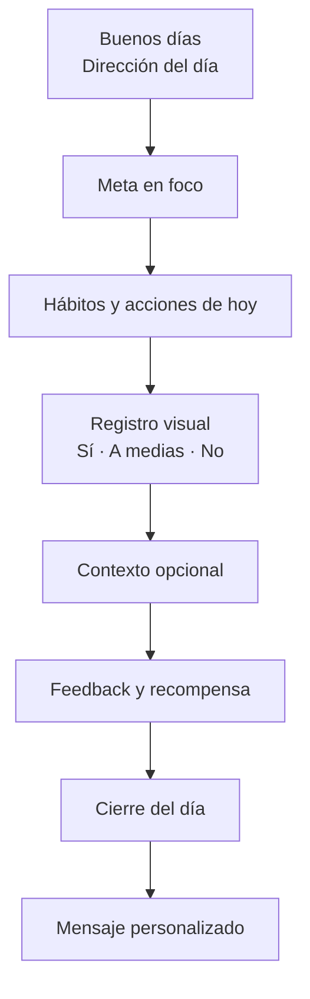
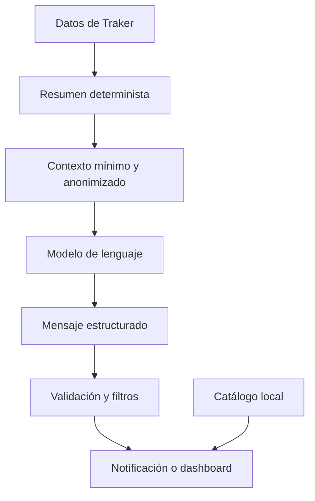

# Traker — visión de acompañante visual del día

Sí. La dirección correcta sería convertir Traker en una especie de **acompañante visual del día**: te despierta recordándote para dónde vas, te pone enfrente únicamente lo que tiene sentido hacer hoy, hace divertido registrar cada hábito y cierra el día interpretando lo ocurrido sin convertirlo en un regaño.

El ciclo completo sería:



## 1. Traker debería acompañar tres momentos

### Inicio del día

Una sola notificación que recuerde:

* Para dónde vas.
* Qué meta tiene prioridad.
* Qué esfuerzo es suficiente hoy.
* Cuál es la recompensa cercana.

Ejemplo:

> **Buenos días, cabrón. Hoy no tienes que arreglar tu vida.**
> Inglés, gym y un paso de tu titulación. Con eso ya le movimos tantito al futuro.

Al tocarla, abriría la pantalla **Hoy**, no una lista genérica.

### Durante el día

Recordatorios contextuales de los hábitos que todavía tengan sentido.

No enviaría una notificación por cada hábito indiscriminadamente. Si tienes ocho actividades, ocho recordatorios te van a enseñar a ignorar Traker.

Usaría tres niveles:

1. Recordatorio del hábito en su ventana preferida.
2. Una segunda oportunidad opcional.
3. Resumen agrupado cuando existan varias actividades.

Ejemplo agrupado:

> **Traes tres cosas pendientes, campeón.**
> No hagas las tres a huevo. Elige una para que el día no se vaya en puro hocico.

### Cierre del día

Una notificación nocturna basada en lo ocurrido:

> **Cerramos el changarro.**
> Fuiste al gym, practicaste inglés y la titulación volvió a hacerse pendeja. Dos de tres: no estuvo nada mal.

O, si no se registró nada:

> **Hoy valió madre productivamente.**
> No te voy a cobrar intereses mañana. Nomás dime qué se atravesó y ajustamos.

## 2. El dashboard debe sentirse como una escena, no como un reporte

La pantalla inicial podría organizarse así:

### A. Escena del día

Una ilustración central que cambie según el contexto:

* Mañana: una alarma arrastrando al cerebro fuera de la cama.
* Día de gym: un cerdo mamado esperando con una mancuerna.
* Saturación: un cerebro cargando quince carpetas.
* Regreso: un proyecto cubierto de polvo sacudiéndose.
* Día completo: el calendario cerrando el changarro.

Junto a ella:

> **Hoy toca mover esto**

Y la meta en foco:

> TOEFL ≥450 · faltan 26 días
> Hoy: Listening durante 25 minutos.

### B. Metas por horizonte

No como tres barras de porcentaje, sino como un recorrido:

```text
AHORA              EN CAMINO              HACIA DÓNDE VOY
TOEFL ≥450    →    Cuidar mi cuerpo   →   Trabajo remoto e independencia
```

Visualmente pueden ser tres estaciones Aurora conectadas por un trazo orgánico. La estación activa tendría brillo y movimiento sutil; las demás permanecerían visibles, pero tranquilas.

### C. Agenda visual

Cada actividad sería una tarjeta grande:

* Ilustración o icono identificable.
* Nombre.
* Meta a la que aporta.
* Momento recomendado.
* Acción de registro.

Ejemplo:

> 🏋️ **Entrenar**
> Le abona a: cuidar mi cuerpo
> Entre 6:00 y 8:00
>
> `Sí fui` `A medias` `Hoy no`

La tarjeta no necesita mostrar estadísticas, rachas ni gráficas en ese momento.

## 3. Registro simple: Sí, a medias o no

Estoy de acuerdo en no utilizar una escala como:

> Mal · Regular · Bien · Excelente.

Eso evalúa el desempeño y obliga a interpretar qué significa "bien". En cambio:

* **Sí**: realicé la conducta acordada.
* **A medias**: hice una versión menor, pero hubo acción.
* **No**: hoy no ocurrió.

No es una calificación; es un estado.

### Para el gym

> **¿Hubo gym o puro cuento?**

* `Sí fui`
* `Medio entrené`
* `Hoy no`

### Si responde "Sí fui"

La tarjeta se transforma visualmente:

* La ilustración levanta la mancuerna.
* El color pasa de superficie neutral a Aurora activa.
* Aparece un trazo completado.
* Vibración breve si está permitida.
* Mensaje inmediato.

> **¡A huevo, marrano!**
> Hoy sí hubo fierros, no puro suplemento.

Después muestra la recompensa:

> Recompensa elegida: café y 20 minutos sin hacer ni madres.

### Si responde "A medias"

No lo trataría como fracaso:

> **Algo hubo. ¿Qué alcanzaste a hacer?**

* Entrené menos tiempo.
* Bajé la intensidad.
* Hice otra actividad.
* Solo calenté.
* Otro.

Después:

> **Versión humilde, pero existente.**
> No cumplió el plan completo, pero acabaste con el cero.

### Si responde "No"

No preguntaría inmediatamente "¿por qué fallaste?". Usaría:

> **Hoy no se armó. ¿Qué se atravesó?**

Chips opcionales:

* Sin energía.
* No tuve tiempo.
* Se me olvidó.
* Trabajo.
* Familia.
* Dinero.
* Dolor o malestar.
* Me distraje.
* No tenía ganas.
* El plan estaba demasiado cabrón.
* Prefiero no decir.
* Otro.

Después ofrecería solo una decisión:

> ¿Qué hacemos con esto?

* `Moverlo`
* `Hacer una versión mínima`
* `Dejarlo por hoy`

No se acumula como deuda para mañana.

## 4. Estado de ánimo y contexto

No preguntaría el estado emocional después de cada hábito incumplido. Eso volvería pesado el registro y podrías acabar asociando Traker con responder cuestionarios.

Haría dos niveles:

### Contexto rápido por hábito

Solo si respondes "A medias" o "No":

> ¿Qué se atravesó?

Una selección y listo.

### Check-in diario opcional

En el cierre del día:

> **¿Cómo anduvo la maquinaria hoy?**

Tres indicadores visuales:

* Ánimo.
* Energía.
* Presión o estrés.

Con una escala breve de tres estados:

```text
Bajo · Medio · Alto
```

Después:

> **¿Qué estuvo haciendo ruido?**

* Familia.
* Trabajo.
* Finanzas.
* Salud.
* Relación.
* Sueño.
* Alimentación.
* Futuro.
* Nada en particular.
* Otro.

Esto permitiría descubrir patrones como:

> Durante las últimas tres semanas, los días con poco sueño se relacionaron con más hábitos omitidos.

Pero Traker debe presentarlo como una observación, no como diagnóstico:

> **Parece que los días con poco sueño te cuesta más iniciar.**
> Es una relación en tus registros, no necesariamente la causa.

Estos datos son sensibles. Deben ser opcionales, protegidos por RLS, eliminables y excluidos de notificaciones visibles en la pantalla bloqueada.

## 5. Motor inteligente de mensajes

Sí tiene sentido utilizar una API, pero no dejaría que la IA administre directamente los hábitos ni "interprete tu mente".

La arquitectura correcta sería:



### Lo que calcula Traker

Sin IA:

* Actividades programadas.
* Cuántas completaste.
* Cuáles quedaron a medias.
* Días de ausencia.
* Metas relacionadas.
* Próxima acción.
* Recompensa disponible.
* Tendencias básicas.
* Horarios.

### Lo que hace la IA

Únicamente convertir ese contexto en una comunicación nueva:

```json
{
  "moment": "evening",
  "tone": "no_respect",
  "summary": {
    "completed": 2,
    "partial": 1,
    "skipped": 1,
    "main_goal": "TOEFL",
    "notable_return": true
  }
}
```

Respuesta esperada:

```json
{
  "title": "Cerramos el changarro",
  "message": "Volviste al inglés, fuiste al gym y la titulación quedó pendiente. No estuvo perfecto, pero tampoco fue puro hocico.",
  "visual_state": "productive_imperfect",
  "suggested_action": "Planear mañana",
  "intensity": "heavy"
}
```

La API de OpenAI permite exigir una respuesta que siga un esquema JSON, lo cual conviene para separar título, mensaje, estado visual y acción sin depender de analizar texto libre. [Structured Outputs de OpenAI](https://developers.openai.com/api/docs/guides/structured-outputs)

### Protección importante

La clave de la API nunca debe ir dentro de la PWA ni en GitHub Pages. La llamada debe salir desde una función segura del backend, por ejemplo una Supabase Edge Function.

Además:

* Enviar solo el resumen necesario.
* No enviar notas emocionales completas por defecto.
* Configurar `store: false` si se usa la Responses API y no se desea el almacenamiento predeterminado descrito por OpenAI. [Guía oficial de Responses API](https://developers.openai.com/api/docs/guides/migrate-to-responses)
* Validar longitud, groserías permitidas y campos.
* No permitir consejos médicos.
* No generar ni atribuir citas de autores sin verificación.
* Tener un catálogo local cuando la API falle.
* Generar varios mensajes por adelantado para reducir costo y dependencia.

## 6. No usar IA para todo

Yo combinaría tres fuentes:

### Catálogo escrito

Para mensajes que tienen que ser realmente buenos:

> **Oinc, oinc. ¿Ya fuiste al gym?**

> **Abre el puto archivo. No se va a programar por ósmosis.**

### Mensajes personales compuestos

Con variables:

> Llevas {daysAway} días sin practicar inglés. ¿Retomamos con {minimumMinutes} minutos o seguimos fingiendo que ver series dobladas cuenta?

### Mensajes generados por IA

Para aperturas y cierres que interpreten el conjunto del día.

Así no dependes de internet para cada interacción y conservas la calidad del humor.

## 7. Sistema visual de estados

Cada hábito necesita un pequeño conjunto de ilustraciones, no una imagen completamente distinta cada vez.

### Gimnasio

| Estado       | Ilustración                              |
| ------------ | ----------------------------------------- |
| Pendiente    | Cerdo mamado esperando con la mancuerna  |
| Recordatorio | Golpea el suelo con el pie               |
| Completado   | Levanta la mancuerna y sale vapor        |
| A medias     | Queda recostado junto a una pesa pequeña |
| No realizado | La mancuerna acumula polvo               |
| Regreso      | Sacude las telarañas y vuelve a cargar   |

### Inglés

| Estado     | Ilustración                               |
| ---------- | ------------------------------------------ |
| Pendiente  | Audífonos esperando sobre un libro        |
| Completado | Las palabras dejan de aparecer como ruido |
| A medias   | Una frase incompleta logra conectarse     |
| Regreso    | El audífono se desenreda                  |

### Programación

| Estado     | Ilustración                                |
| ---------- | -------------------------------------------- |
| Pendiente  | Archivo abierto rodeado de logos y paletas |
| Completado | Aparece un commit sellado                  |
| Bloqueado  | Código atrapado bajo una torre de pestañas |
| Regreso    | El archivo se sacude el polvo              |

Las ilustraciones pueden usar SVG para mantenerse ligeras y adaptar colores. Las animaciones deben ocurrir como respuesta, no moverse continuamente.

## 8. Notificaciones en la PWA

Para que funcionen de manera confiable, las notificaciones programadas deben salir desde el servidor. No confiaría en que un temporizador del navegador permanezca vivo cuando la app esté cerrada.

Como Traker utiliza Supabase, una arquitectura razonable sería:

```text
Supabase Cron
→ Edge Function
→ Selección de usuarios y actividades
→ Mensaje local o generado
→ Web Push
→ Service Worker
→ Notificación
```

Supabase permite programar Edge Functions mediante Cron y `pg_net`. [Documentación de Supabase](https://supabase.com/docs/guides/functions/schedule-functions)

En iPhone hay una condición importante: Web Push está soportado para aplicaciones web agregadas a la pantalla de inicio y necesita permiso del usuario. [WebKit: Web Push en iOS y iPadOS](https://webkit.org/blog/13878/web-push-for-web-apps-on-ios-and-ipados/)

Por eso Traker necesita un onboarding específico:

1. Instalar Traker en la pantalla de inicio.
2. Explicar el beneficio.
3. Pedir permiso como resultado de una acción del usuario.
4. Enviar una notificación de prueba.
5. Confirmar que llegó.
6. Configurar horario matutino y nocturno.

## 9. Presupuesto de notificaciones

Configuración recomendada:

### Siempre

* Una apertura del día.
* Un cierre del día.

### Durante el día

* Máximo dos empujones adicionales.
* Agrupar hábitos cercanos.
* No recordar algo ya realizado.
* No repetir el mismo chiste.
* Respetar horas silenciosas.
* Permitir "hoy déjame en paz".
* Reducir frecuencia si se ignoran repetidamente.

Ejemplo:

```text
07:00  Apertura
12:30  Recordatorio contextual o agrupado
18:00  Segunda oportunidad, solo si aporta
21:30  Cierre
```

No significa que siempre lleguen cuatro. El motor decide si el mensaje intermedio sigue siendo oportuno.

## 10. El cierre del día como momento principal

Creo que este puede ser el elemento más valioso.

La pantalla nocturna mostraría:

> **HOY**
>
> 2 completados
> 1 versión mínima
> 1 que no se armó

Debajo, una ilustración que represente cómo terminó el día y un mensaje:

> **No fue una obra maestra, pero sí hubo movimiento.**
> Fuiste al gym, retomaste inglés y redujiste una tarea en lugar de abandonarla. Eso sí cuenta, cabrón.

Luego:

> **¿Cómo anduvo la maquinaria?**
>
> Ánimo: medio
> Energía: baja
> Presión: alta
> Principal ruido: trabajo

Y una sola pregunta para mañana:

> **Con esta energía, ¿qué sí tiene sentido conservar?**

No pediría planear toda la agenda desde cero.

## 11. Nuevas entidades necesarias

| Entidad                    | Función                                 |
| --------------------------- | ----------------------------------------- |
| `daily_checkins`           | Ánimo, energía y presión                |
| `daily_influences`         | Familia, trabajo, finanzas, etc.        |
| `habit_logs.status`        | Sí, parcial o no                        |
| `habit_log_reasons`        | Qué se atravesó                         |
| `daily_summaries`          | Resumen calculado del día               |
| `generated_messages`       | Mensajes creados o elegidos             |
| `message_feedback`         | Me gustó, no dio risa, no volver a usar |
| `notification_preferences` | Horarios, privacidad e intensidad       |
| `push_subscriptions`       | Dispositivos autorizados                |
| `notification_jobs`        | Programación y reintentos               |
| `notification_deliveries`  | Enviado, entregado o interactuado       |
| `visual_states`            | Ilustración asociada al contexto        |

## 12. Implementación por etapas

### Primera etapa

* Registro Sí/A medias/No.
* Razones opcionales.
* Check-in nocturno.
* Apertura y cierre con catálogo local.
* Diseño visual de tres hábitos piloto.
* Notificaciones programadas sin IA.

### Segunda etapa

* Motor de mensajes contextual.
* Prevención de repetición.
* Resúmenes diarios.
* Recompensas.
* Ilustraciones y animaciones extendidas.

### Tercera etapa

* Integración con OpenAI.
* Mensajes matutinos y nocturnos generados.
* Resumen anonimizado.
* Filtros.
* Caché y fallback.
* Feedback para aprender qué mensajes te dan risa.

### Cuarta etapa

* Análisis de patrones.
* Ajuste de horarios.
* Recomendación de versiones mínimas.
* Detección de saturación.
* Comparación entre energía, contexto y cumplimiento.

La clave es que la IA no sería "el cerebro" de Traker. Traker tendría reglas claras y confiables; la IA sería **el cabrón creativo que convierte tus datos del día en un mensaje que sí quieras leer**.
