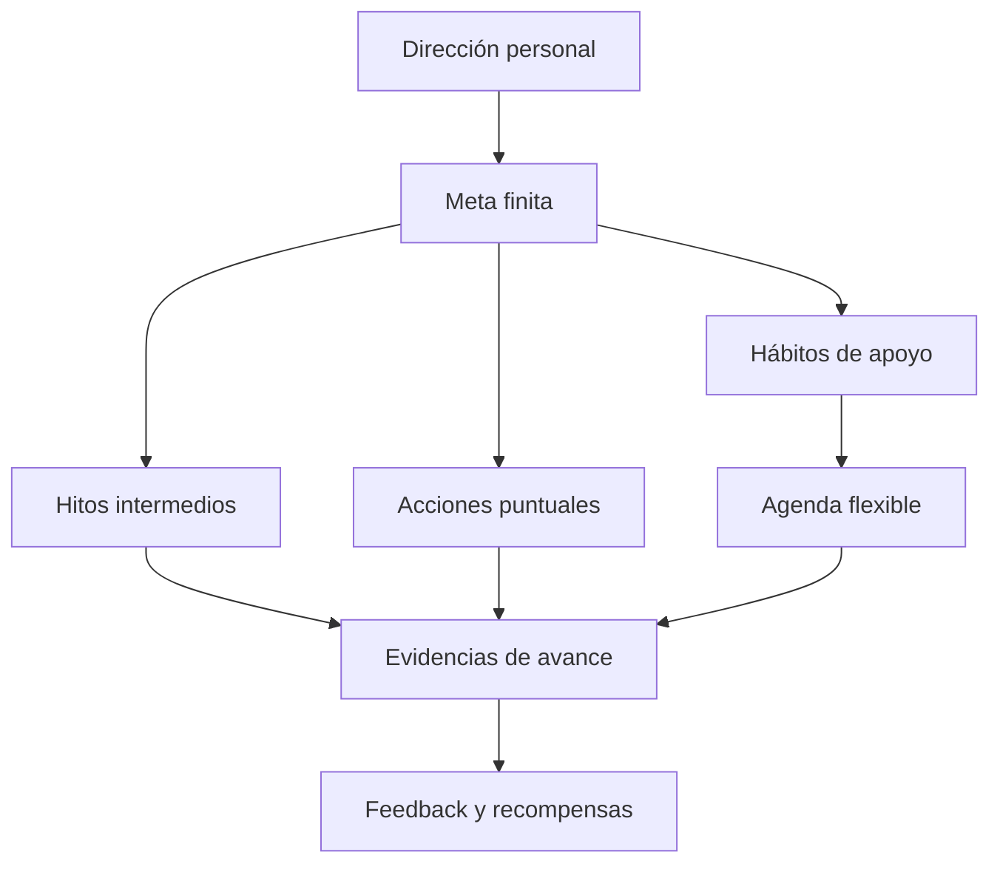

# Traker Metas — visión de reestructuración

Sí: Traker necesita reestructurarse alrededor de una relación clara entre **dirección, metas, hitos, hábitos, acciones y recompensas**. Actualmente, pensar solamente en “lista de hábitos” se queda corto; pero convertir cada meta en veinte obligaciones diarias también te saturaría.

La idea central sería:

> **La meta dice adónde vas; los hitos demuestran que avanzas; los hábitos sostienen el recorrido; las acciones resuelven cosas puntuales; y las recompensas acercan el beneficio al presente.**



## 1. El cambio conceptual más importante

No todo lo que impulsa una meta es un hábito.

Para “obtener más de 450 puntos en el TOEFL” necesitarías:

| Elemento             | Ejemplo                                          |
| -------------------- | ------------------------------------------------ |
| Meta                 | Obtener al menos 450 puntos en el TOEFL          |
| Definición de cierre | Presentar el examen y recibir ≥450               |
| Hito                 | Alcanzar 450 en un simulacro                     |
| Acción puntual       | Investigar fechas y registrar el examen          |
| Hábito               | Escuchar inglés 25 minutos                       |
| Sesión               | Resolver Listening durante 20 minutos            |
| Evidencia            | Resultado de un simulacro: 438                   |
| Recompensa           | Café o descanso después de una sesión consciente |

Si Traker únicamente relaciona metas con hábitos, faltaría todo lo que no es recurrente: inscribirte, presentar simulacros, reunir documentos o realizar el examen.

Por eso recomiendo este modelo mínimo:

```text
Meta
├── Motivo personal
├── Resultado esperado
├── Definición de terminada
├── Horizonte
├── Hitos
├── Acciones puntuales
├── Hábitos vinculados
├── Evidencias
└── Recompensas
```

## 2. Corto, mediano y largo plazo

No deberían ser módulos distintos ni depender de rangos rígidos. Para ti, mudarte en cinco meses puede sentirse como largo plazo aunque otra persona lo considere mediano.

El horizonte debe ser una propiedad elegida por el usuario:

### Corto plazo

Algo concreto que ocupa la atención actual.

> Obtener al menos 450 puntos en el TOEFL durante el próximo mes.

Necesita:

* Una fecha clara.
* Próxima acción.
* Pocos hitos.
* Práctica frecuente.
* Feedback rápido.

### Mediano plazo

Una transformación que requiere varias semanas o meses.

> Reducir mi porcentaje de grasa y mejorar mi cuidado personal durante los próximos tres meses.

Necesita:

* Indicadores periódicos.
* Hábitos flexibles.
* Revisión quincenal o mensual.
* Ajustes según resultados y energía.
* Acciones puntuales además de hábitos.

### Largo plazo

Una dirección importante compuesta por varios resultados.

> Conseguir un empleo remoto e independizarme en otro estado.

Necesita:

* Metas relacionadas de corto y mediano plazo.
* Hitos: titulación, portafolio, solicitudes, entrevistas, presupuesto, vivienda.
* Revisiones mensuales.
* Una prioridad actual para no mostrar todo diariamente.

Traker permitiría cambiar el horizonte posteriormente sin perder historial.

## 3. Una meta puede compartir hábitos con otras metas

Este punto es fundamental. No se deben duplicar hábitos.

Por ejemplo, “practicar inglés” puede aportar simultáneamente a:

* Aprobar el TOEFL.
* Prepararte para mejores empleos.
* Conseguir trabajo remoto.
* Mudarte e independizarte.

La relación técnicamente debe ser muchos a muchos:

```text
Una meta ── puede usar ── varios hábitos
Un hábito ── puede apoyar ── varias metas
```

Al abrir “Practicar inglés” podrías ver:

> **Este hábito le abona a:**
>
> * TOEFL ≥450.
> * Conseguir trabajo remoto.
> * Independizarme.

Pero en el dashboard aparecería una sola vez.

## 4. No todo debe programarse diariamente

Tu preocupación por la saturación es correcta. Traker necesita más posibilidades que “todos los días”:

* Días específicos.
* X veces por semana.
* Cada cierto número de días.
* Una vez durante una ventana.
* Alternancia entre actividades.
* Elegir una actividad de un grupo.
* Solo en determinados contextos.
* Frecuencia flexible sin día predeterminado.

### Ejemplo de semana realista

| Actividad                       |         Frecuencia | Flexibilidad                   |
| -------------------------------- | ------------------: | ------------------------------- |
| Escuchar inglés conscientemente | 4 veces por semana | Cualquier día                  |
| Práctica TOEFL específica       | 2 veces por semana | Una entre semana y otra el fin |
| Repasar ciencia de datos        | 2 veces por semana | Alternable con portafolio      |
| Entrenamiento                   | 5 veces por semana | Según rutina                   |
| Revisar avance corporal         |       Cada 15 días | Ventana de tres días           |
| Trabajar en portafolio          | 2 veces por semana | 25–45 minutos                  |

### Grupos de alternancia

Traker necesita una entidad como “bloque flexible”:

> **Hoy toca aprendizaje. Elige uno:**
>
> * Inglés, 25 minutos.
> * Ciencia de datos, 25 minutos.
> * Portafolio, 25 minutos.

Al completar cualquiera, el bloque cuenta. Esto evita mostrar tres obligaciones cuando tu capacidad real es hacer una.

También podría configurarse:

> Esta semana quiero completar cuatro sesiones de aprendizaje: al menos dos de inglés y las restantes de inglés, maestría o portafolio.

Eso es mucho más útil que fijar una secuencia rígida de lunes inglés, martes maestría, porque permite adaptarse sin perder estructura.

## 5. Replanteamiento del dashboard

La pantalla inicial no debería comenzar con métricas ni con una cuadrícula enorme de hábitos. Debe responder, en orden:

1. ¿Para dónde voy?
2. ¿Qué importa actualmente?
3. ¿Qué puedo hacer hoy?
4. ¿Qué recompensa tengo cerca?

### Estructura recomendada

#### A. Apertura del día

> **Buenos días, Kevin.**
>
> No tienes que resolver tu pinche vida hoy. Nomás mover algo que sí te importa.

Debajo:

> **Acuérdate para qué:** estás construyendo la posibilidad de trabajar desde donde quieras e independizarte.

Acciones pequeñas:

* `Ver mi dirección`
* `Cambiar el tono de hoy`

#### B. Meta en foco

No mostraría las tres metas con la misma jerarquía. Una debe ser el foco actual:

> **EN FOCO · CORTO PLAZO**
> Obtener 450 puntos en el TOEFL
> Faltan 27 días
>
> **Lo que sigue:** hacer un diagnóstico de Listening.
> 25 minutos · energía media
>
> `Empezar` `Hacerlo más pequeño`

#### C. Tus horizontes

Después aparecerían tres tarjetas compactas:

| Ahora        | En camino                    | Hacia dónde voy                |
| ------------ | ----------------------------- | -------------------------------- |
| TOEFL ≥450   | Mejorar composición corporal | Trabajo remoto e independencia |
| Corto plazo  | Mediano plazo                 | Largo plazo                     |
| Próximo hito | Revisión próxima              | Etapa actual                    |

En escritorio pueden mostrarse en tres columnas. En móvil, una tarjeta principal y las otras dos resumidas, sin un carrusel obligatorio que esconda información.

#### D. Lo que toca hoy

Los hábitos y acciones se agruparían por intención, no como lista plana:

> **Hoy le abonamos a tu inglés**
>
> * Escuchar 25 minutos.
> * Resolver 10 ejercicios de Listening.

> **Hoy cuidamos la maquinaria**
>
> * Entrenamiento.
> * Higiene personal.
> * Elegir una comida planificada.

> **Bloque flexible**
>
> Elige inglés, ciencia de datos o portafolio.

#### E. Recompensa cercana

> **Lo que te espera**
>
> Termina tu sesión de inglés y tómate ese café sin estar pensando que “todavía no hiciste suficiente”.

## 6. La frase diaria necesita propósito

No pondría solamente una cita aleatoria. A los pocos días se convertiría en decoración.

Usaría tres tipos de mensajes:

### 60%: recordatorio personal

Generado a partir del motivo real de tus metas:

> No estás estudiando inglés por amor a los phrasal verbs. Lo haces para abrirte más opciones de trabajo.

> El gimnasio no es el destino. Quieres sentirte cómodo con tu cuerpo y cuidar de ti.

### 25%: carrilla motivacional

> Buenos días, cabrón. Tu futuro departamento no se va a rentar con buenas intenciones.

> Hoy no tienes que dominar el inglés. Nomás dejar de huirle 25 minutos.

> Un día no cambia tu vida, pero seguir haciéndote pendejo tampoco ayuda.

### 15%: citas verificadas

Pueden aparecer autores menos obvios, pero Traker debe almacenar:

* Texto exacto.
* Autor.
* Obra o fuente.
* Idioma original.
* Traducción revisada.
* Tema.
* Licencia o condición de uso.

No conviene obtener frases aleatoriamente de internet: abundan atribuciones falsas. Sería mejor un catálogo curado, posiblemente con textos de dominio público, y permitir guardar las favoritas.

Además, la frase de la notificación matutina y la de la pantalla inicial deben ser la misma para conservar continuidad.

## 7. Recompensas inmediatas, semanales y de cierre

Sí tiene sentido acercar las recompensas: un metaanálisis encontró mayor descuento de recompensas demoradas en personas con TDAH frente a controles, aunque estudió principalmente decisiones monetarias y no demuestra por sí solo qué diseño de app funciona mejor. Es una base razonable para probar feedback y beneficios cercanos, no para afirmar que “todo cerebro con TDAH funciona igual”. [Jackson y MacKillop, 2016](https://pubmed.ncbi.nlm.nih.gov/27722208/)

La recompensa debería tener cuatro niveles.

### Inmediata: después de actuar

No siempre tiene que ser material:

* Mensaje de reconocimiento.
* Animación breve.
* Evidencia registrada.
* Descanso de cinco minutos.
* Café.
* Escuchar una canción.
* Ver algo breve.
* Cambiar a una actividad agradable.

Ejemplo:

> **Hoy sí hubo inglés, no puro “mañana empiezo”.**
> Ya puedes tomarte ese café. Esta vez sí te lo ganaste, animal.

### Diaria: por un día suficientemente bueno

No exigiría completar absolutamente todo.

El usuario define:

* Obligaciones esenciales.
* Actividades opcionales.
* Mínimo suficiente.

Ejemplo:

```text
Día suficiente
✓ Completar 2 de 3 esenciales
✓ O completar 1 esencial y 1 sesión mínima
```

Mensaje:

> **No hiciste todo. Hiciste lo que hoy sí importaba.**
> Proceda con su café, cabrón.

### Semanal: por alcanzar frecuencias

En lugar de “los siete días perfectos”:

```text
Recompensa semanal
Gym: al menos 4 de 5
Inglés: al menos 3 de 4
Alimentación planificada: al menos 5 registros
```

Puede utilizar reglas:

* Cumplir todos los mínimos.
* Cumplir 2 de 3.
* Alcanzar determinado porcentaje general.
* Completar un hábito específico.
* Completar cualquiera de un grupo.

Mensaje:

> **La semana no fue perfecta, pero tampoco fue puro hocico.**
> Cumpliste tus mínimos. Recompensa desbloqueada: chocolate.

### Mensual o por hito

Ejemplo:

> Si cumplo al menos tres de las cuatro semanas con ejercicio y alimentación planificada, puedo comprar una playera deportiva.

O:

> Cuando obtenga 450 en un simulacro, me compro los audífonos que elegí.

No usaría puntos, monedas ni una tienda ficticia. La recompensa es real, elegida por ti y ligada a una condición comprensible.

Hay un matiz: las recompensas tangibles, esperadas y controladoras pueden reducir la motivación intrínseca en ciertas condiciones. Por eso Traker debe preservar elección, recordar el motivo personal y usar la recompensa como apoyo, no como soborno obligatorio. [Metaanálisis de Deci, Koestner y Ryan](https://pubmed.ncbi.nlm.nih.gov/10589297/)

## 8. Agrupar hábitos para una recompensa

Sí necesitas “planes de recompensa” independientes de una sola meta.

Ejemplo:

### Plan: “La playera que no necesito, pero quiero”

Periodo: 1 mes.

Hábitos relacionados:

* Entrenar 5 veces por semana.
* Cumplir el mínimo semanal de alimentación planificada.
* Realizar tres de cuatro revisiones semanales.

Condición:

> Cumplir al menos tres semanas completas de cuatro.

Recompensa:

> Comprar una playera deportiva de hasta $800.

Traker mostraría:

> **Vas 2 de 3 semanas suficientes.**
> Una semana más y puedes comprar la playera sin inventarte excusas financieras.

La recompensa podría relacionarse con:

* Un hábito.
* Varios hábitos.
* Una meta.
* Un hito.
* Un bloque flexible.
* Una combinación.

## 9. No usar “todo o nada”

Evitaría estas reglas:

* “Si no cumpliste un hábito, perdiste la recompensa”.
* “Rompiste la semana”.
* “Volviste a cero”.
* “Debes recuperar ayer”.
* “Te faltó uno, así que no cuenta”.

Utilizaría:

* Mínimo.
* Objetivo.
* Extra opcional.
* Semana suficiente.
* Ajuste consciente.
* Regreso sin deuda.

Ejemplo:

```text
Inglés esta semana

Mínimo suficiente: 3 sesiones
Objetivo: 4 sesiones
Extra opcional: 5 sesiones
```

Traker no necesita medallas. Solo comunicar:

> **3 sesiones:** cumpliste el acuerdo.
> **4 sesiones:** llegaste al objetivo.
> **5 sesiones:** te mamaste, pero con orden.

## 10. No convertir cualquier conducta en parte de la misma meta

Aquí conviene ser preciso:

* Lavarte los dientes sí es autocuidado, pero no necesariamente mide el progreso hacia 15% de grasa.
* Medirte la glucosa debe ser una decisión personal o clínica, no una recomendación automática de Traker.
* “No comer carbohidratos” es demasiado general y restrictivo para modelarlo como hábito.
* Una medición corporal quincenal es evidencia, no un hábito diario.
* El porcentaje de grasa puede variar según el método de medición; la app debe registrar método y tendencia, no juzgar una lectura aislada.

Para la meta corporal separaría:

### Resultado

> Mejorar mi composición corporal hasta el objetivo que defina responsablemente.

### Hábitos directamente relacionados

* Entrenamiento.
* Alimentación planificada.
* Sueño.
* Cardio, si forma parte del plan.

### Autocuidado relacionado, pero independiente

* Higiene dental.
* Cuidado de la piel.
* Imagen personal.

### Mediciones

* Peso quincenal.
* Circunferencia.
* Porcentaje estimado de grasa.
* Fotografías opcionales y privadas.

Traker debe ser una herramienta de seguimiento, no decidir metas médicas ni prescribir controles. NICE recomienda estructura y apoyo psicológico enfocados en TDAH cuando corresponde, además de reconocer el valor general del ejercicio y la nutrición equilibrada, pero Traker no sustituye esa atención. [Guía NICE para TDAH](https://www.nice.org.uk/guidance/ng87/chapter/recommendations)

## 11. Las acciones “si-entonces”

Al crear un hábito, Traker debería preguntar opcionalmente:

> ¿Cuándo es más probable que ocurra?

Ejemplo:

> Si termino de desayunar, escucharé inglés durante 25 minutos.

> Si llego del gimnasio, registraré el entrenamiento antes de bañarme.

> Si es martes o jueves después del trabajo, abriré mi portafolio 25 minutos.

Las intenciones de implementación convierten una intención general en una respuesta vinculada a una situación; la evidencia general —no específica exclusivamente de adultos con TDAH— ha encontrado efectos favorables sobre el logro de objetivos. [Síntesis del National Cancer Institute](https://cancercontrol.cancer.gov/brp/research/constructs/implementation-intentions)

No debe ser obligatorio llenar “cuándo, dónde, por qué, con quién y nivel de energía” para cada hábito. Una sola condición útil basta.

## 12. Arquitectura funcional recomendada

### Entidades principales

| Entidad            | Propósito                           |
| ------------------- | ------------------------------------ |
| `goals`            | Resultado finito                    |
| `goal_milestones`  | Resultado intermedio                |
| `goal_actions`     | Acción única                        |
| `habits`           | Conducta recurrente                 |
| `goal_habits`      | Relación muchos a muchos            |
| `habit_schedules`  | Frecuencia y ventanas               |
| `habit_logs`       | Cumplimiento real                   |
| `flexible_groups`  | Alternancia o elección              |
| `goal_evidence`    | Mediciones y señales de avance      |
| `reward_plans`     | Recompensas configuradas            |
| `reward_rules`     | Condiciones                         |
| `reward_links`     | Hábitos, metas o hitos relacionados |
| `daily_messages`   | Catálogo de aperturas               |
| `personal_anchors` | Motivos personales reutilizables    |
| `daily_focus`      | Prioridad elegida para el día       |

### Estados de meta

```text
idea
activa
pausada
bloqueada
completada
reformulada
cerrada conscientemente
archivada
```

### Estados de una actividad diaria

```text
pendiente
completada
versión mínima
omitida conscientemente
reprogramada
no aplicaba
```

“Omitida conscientemente” no sería un fracaso; simplemente explica por qué no debe arrastrarse.

## 13. Navegación nueva

Yo reduciría la navegación principal a:

* **Hoy**
* **Rumbo**
* **Hábitos**
* **Recompensas**
* **Historial**
* **Ajustes**

### Hoy

Mensaje diario, meta en foco y agenda flexible.

### Rumbo

Metas de corto, mediano y largo plazo, hitos y acciones.

### Hábitos

Biblioteca completa, horarios, alternancias y relaciones con metas.

### Recompensas

Planes diarios, semanales, mensuales y por hito.

### Historial

Evidencias, regresos, cierres y progreso sin rachas punitivas.

“Metas” podría llamarse **Rumbo** en la interfaz y mantenerse como `goals` técnicamente. Es más amplio y evita que la pantalla parezca una lista de pendientes gigantes.

## 14. Ejemplo completo con tus tres metas

### Corto plazo: TOEFL

**Resultado:** obtener ≥450.

**Hitos:**

* Hacer diagnóstico.
* Registrar examen.
* Obtener ≥420 en simulacro.
* Obtener ≥450 en simulacro.
* Presentar examen.

**Hábitos:**

* Listening consciente 4 veces por semana.
* Práctica específica 2 veces por semana.

**Acción inmediata:**

* Elegir fecha de examen.

**Recompensas:**

* Inmediata: café después de la sesión.
* Semanal: actividad agradable tras cumplir mínimos.
* Hito: recompensa elegida al lograr ≥450 en simulacro.

### Mediano plazo: composición corporal y autocuidado

**Resultado:** objetivo corporal definido y revisable.

**Hábitos:**

* Entrenamiento según rutina.
* Alimentación planificada.
* Sueño.
* Autocuidado independiente.

**Evidencias:**

* Medición quincenal.
* Tendencia mensual.
* Cómo te sientes con tu imagen y energía.

**Recompensas:**

* Semanal: algo pequeño.
* Mensual: playera deportiva si se cumplen mínimos de ejercicio y alimentación.

### Largo plazo: independencia y trabajo remoto

**Hitos:**

* Concluir titulación.
* Preparar CV y portafolio.
* Fortalecer inglés.
* Enviar solicitudes.
* Aceptar entrevistas.
* Crear presupuesto.
* Elegir ciudad.
* Buscar vivienda.

**Hábitos compartidos:**

* Inglés.
* Práctica técnica.
* Portafolio.
* Revisión financiera.

**Acciones puntuales:**

* Enviar CV.
* Agendar examen.
* Terminar un proyecto.
* Comparar rentas.

La meta de independencia no necesitaría diez hábitos exclusivos. Reutilizaría los que ya están construyendo las capacidades necesarias.

## 15. Orden de implementación

No desarrollaría todo de golpe.

### Fase 1: modelo correcto

* Metas con horizonte.
* Motivo y definición de cierre.
* Hitos.
* Acciones.
* Relación muchos a muchos con hábitos.
* Migración de hábitos actuales sin perder datos.

### Fase 2: agenda flexible

* Frecuencia semanal.
* Ventanas.
* Alternancia.
* Mínimo, objetivo y extra.
* Omisión consciente.
* Próxima acción.

### Fase 3: nuevo dashboard

* Mensaje matutino.
* Meta en foco.
* Tres horizontes.
* Agenda de hoy agrupada.
* Siguiente recompensa.

### Fase 4: recompensas

* Planes agrupados.
* Condiciones flexibles.
* Recompensas inmediatas, semanales y por hito.
* Registro de reclamadas o descartadas.

### Fase 5: personalidad

* Catálogo mexicano “sin respeto”.
* Mensajes personalizados por contexto.
* Ilustraciones.
* Notificaciones adaptativas.
* Prevención de repetición.

## Conclusión

La reestructuración correcta no es:

> Meta → lista de hábitos diarios.

Debe ser:

> **Dirección → meta → hitos y acciones → hábitos flexibles → agenda de hoy → evidencia → recompensa cercana.**

Y el dashboard no debería preguntarte “¿cumpliste todo?”. Debería decirte:

> **Buenos días, cabrón. Acuérdate para dónde vas.**
> Hoy no tienes que titularte, hablar inglés perfecto, bajar diez puntos de grasa y mudarte de estado.
> **Hoy toca escuchar 25 minutos, entrenar y enviar ese pinche correo. Con eso ya movimos la vida tantito.**
